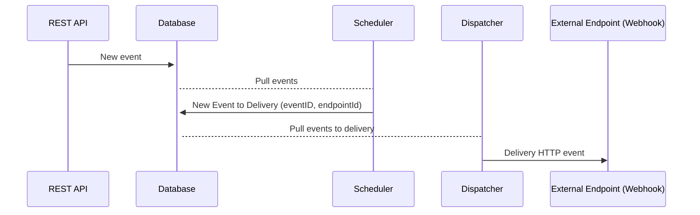

```mermaid
sequenceDiagram
    REST API->>+Database: New event
    Database-->Scheduler: Pull events
    Scheduler->>+Database: New Event to Delivery (eventID, endpointId)
    Database-->Dispatcher: Pull events to delivery
    Dispatcher->>External Endpoint (Webhook): Delivery HTTP event
```
